# 这是一个Azure OpenAI 的客户端
当您拿到Azure OpenAI的订阅时，创建完服务，可以使用这个项目来部署第一个应用，分享给同事或朋友一起探索。<br/>


- 前端是用Vue 3 + TypeScript + Vite来实现. 移动设备显示可自适应。<br/>
- 后端使用express JS API来调用Azure API 管理平台，再到Azure OpenAI的endpoint. AOAI的key不会提供给前端<br/>
- 聊天记录不会在后端保存，但可以使用APIM的日志管理和审计特性来管理。
- 支持 GPT-3.5和 GPT-4 的流式API显示
- 支持定义多种参数的多个聊天app, 不同的app不同的url, 可以分发给不同的人。也方便对比不同参数的效果。
- 这个repo没有整合 AAD 认证和登录，需要的参考tsgptAAD
- 可以通过APIM的Policy实现多AOAI 后端的负载均衡，提高rate limit. 部署完后，参考后面负载均衡的部份。

部署的架构参考:
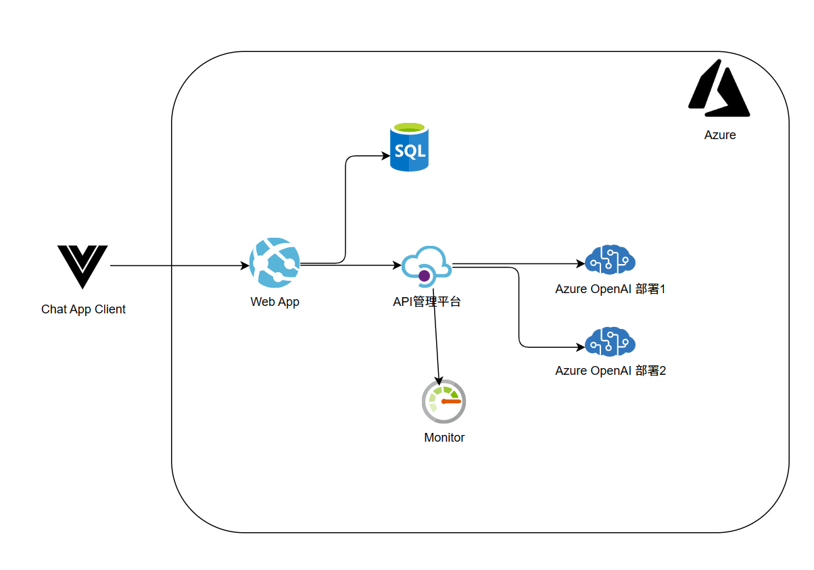
添加App时指定参数：
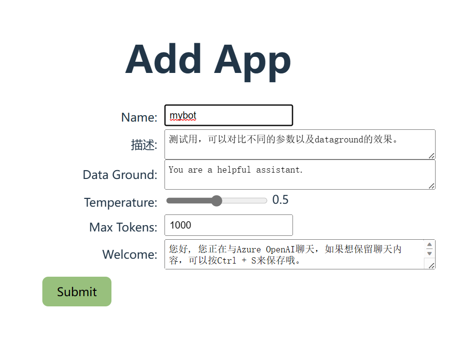
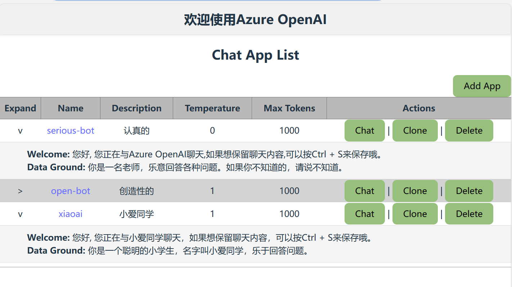
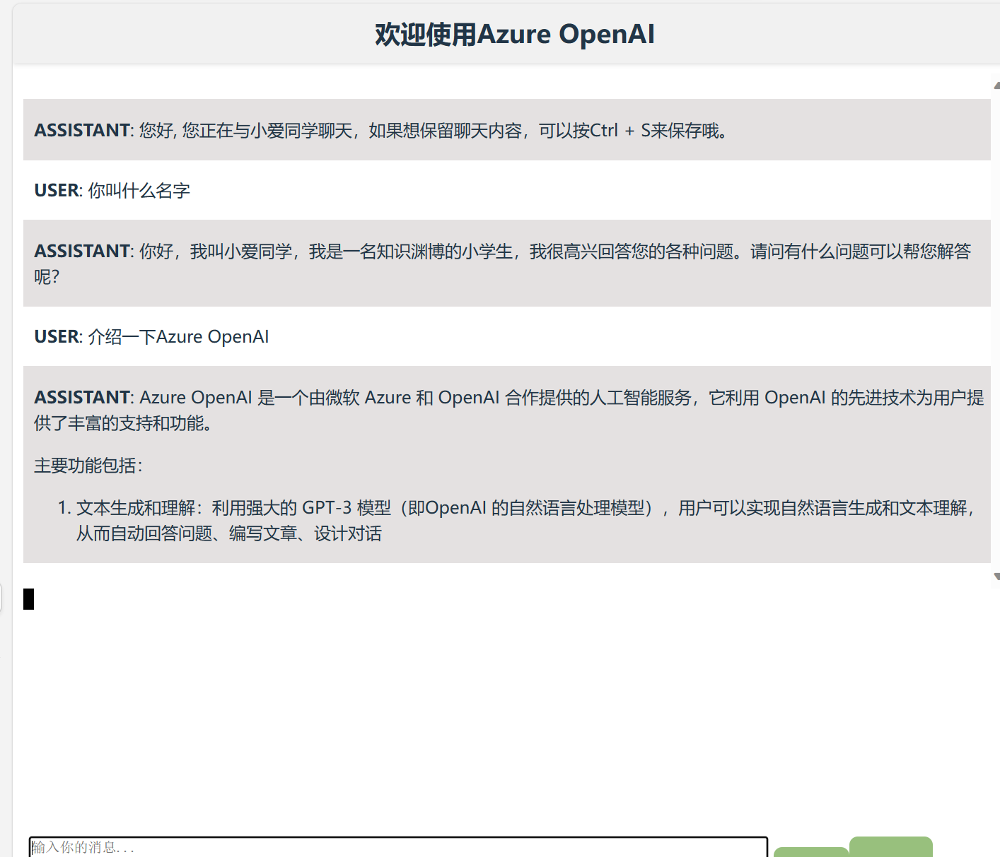

## 部署步骤
### 创建Azure资源
- 下载安装sqlcmd, 用于初始化数据库。***安装完请重新打开PowerShell命令窗口***  https://learn.microsoft.com/zh-cn/sql/tools/sqlcmd/sqlcmd-utility?view=sql-server-ver16

- 获取Azure OpenAI的部署，模型ID和Key

- 打开[./script/deploy.ps1](./script/deploy.ps1), 按提示修改如下变量:

```bash
$RESOURCE_GROUP_NAME="rgOpenAIChat"
$LOCATION="eastasia"
#for DB
#需全球唯一
$SQL_SERVER_NAME="<your unique sql server name>"
$ADMIN_USERNAME="<your admin username>"
$ADMIN_PASSWORD=Read-Host "Enter the admin password"
$DB_NAME="dbGPT"

#for APIM
#需全球唯一
$SVC_NAME="<your unique apim name>"
$API_ID="azuregpt-api"
$AOAI_DEPLOYMENT_ID="<your deployment id>"
$AOAI_MODEL_ID="<your model id>"
$AOAI_KEY=$AOAI_KEY = Read-Host "Enter the Azure OpenAI key"
#服务创建完成会发邮件通知
$APIM_PUBLISHER_EMAIL="<your email>"
$PUBLISHER="<your publisher name>"

#for webapp
$VUE_APP_APIM_HOST=$SVC_NAME + ".azure-api.net"
#等待API服务创建完成手动在Portal填写
$VUE_APP_APIM_KEY="xxx"
#需全球唯一, 可改为自己容易记的名字。bot访问的地址为 https://<your app name>.azurewebsites.net
$APP_NAME="chat$(Get-Date -Format 'MMddHHmmss')"
#这个镜像是我自己的，可以不改。如果你修后后有自己的镜像，可以改为自己的镜像地址
$DOCKER_IMAGE="radezheng/tsgpt:basic"

```

- 打开powershell, 运行 script\deploy.ps1 , 等运行完。创建APIM需要大概20分钟到半小时。收到邮件后再继续下面部步骤.

## 配置Azure资源
 - APIM策略，打开.\apim\policy.xml, 复制全部内容，粘贴到 azure portal里的apim policy。如果想用多个aoai 后端，忽略这步。参考后面多个后端的配置。
 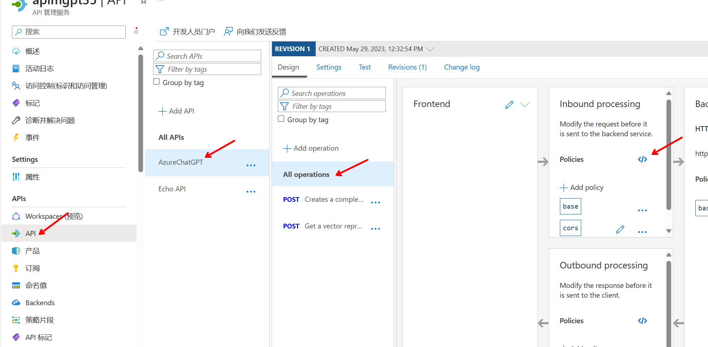
 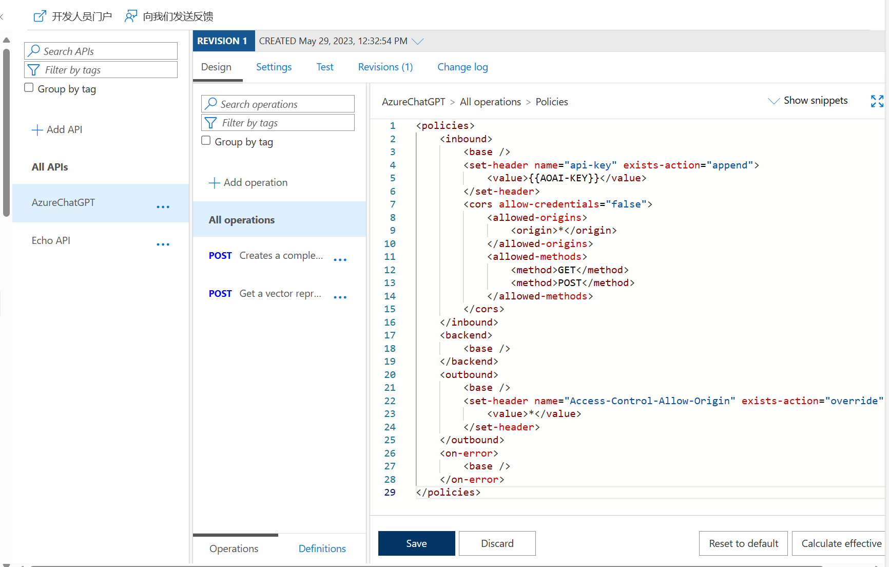

 - 获取apim的key, 更新到web app的环境变量.
 打开APIM的订阅，显示Unlimited订阅的key:
 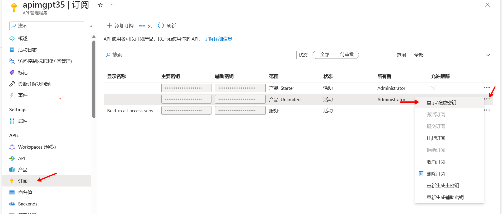
 复制key:
 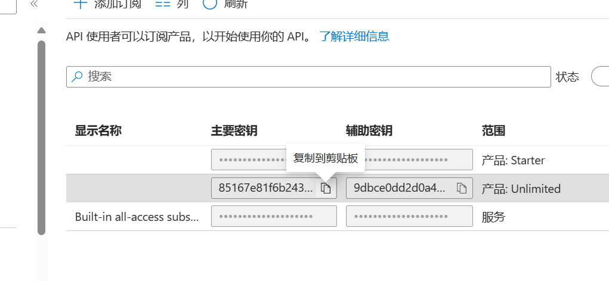
 打开Web App, 在配置里更新 VUE_APP_APIM_KEY
 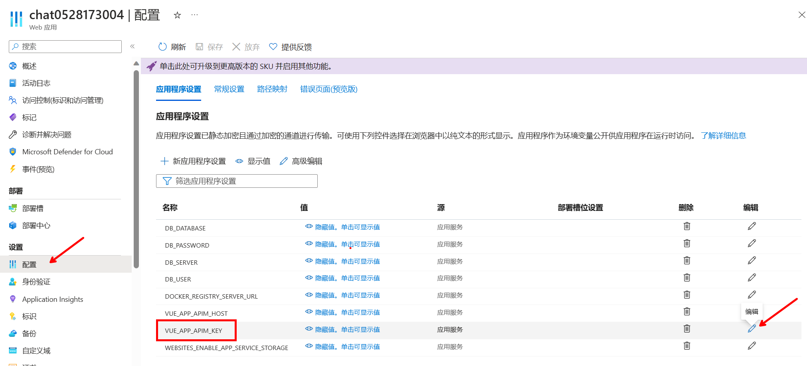
 重启一个Web App

 - 部署完成
 正常的话应该可以访问部署后的webapp, 第一次打开会有点慢。
 https://<app_name>.azurewebsites.net
 

## [可选] 部署多个Azure OpenAI的Endpoint/key
- 创建和部署多个Azure OpenAI的GPT3.5或GPT4模型，并拿到相关demployment id, model id和key
- 在Azure APIM 创建多个backend:
URL格式必须是一样，不能多不能少。并设定api-key的header. 可以为手动指定，或命名值。
```bash
# 替换为相应backend的值 
https://<depoyment_id>.openai.azure.com/openai/deployments/<model_id>  
```
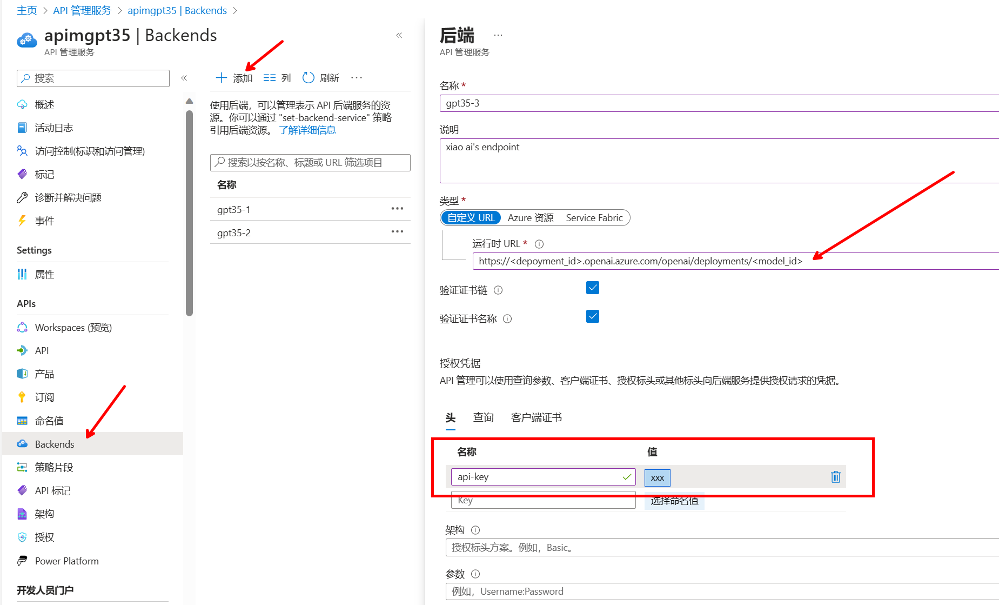
- 打开API *** Post *** 接口的Policy:
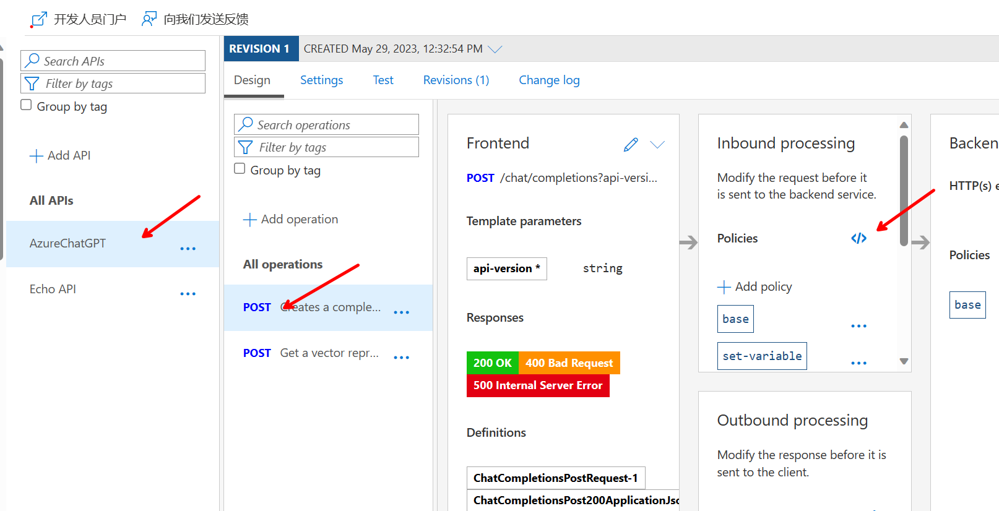
- 将 内容全部复制替换 为 ./apim/loadbanlance.xml
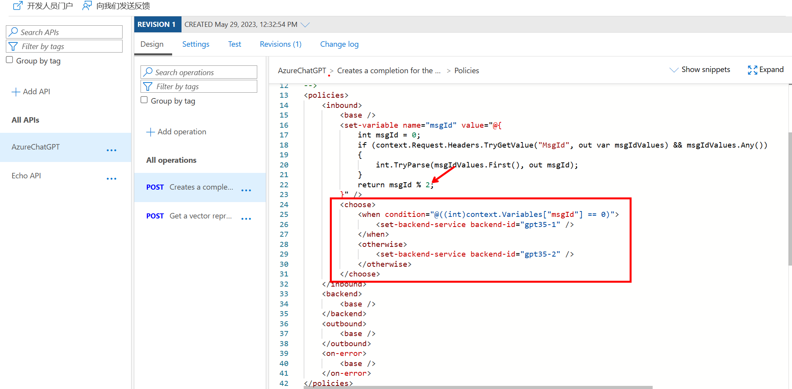
如果有多个backend, 修改 "2" 为相应的数量，并按条件增加路由项。
## [可选] API的监控与审计
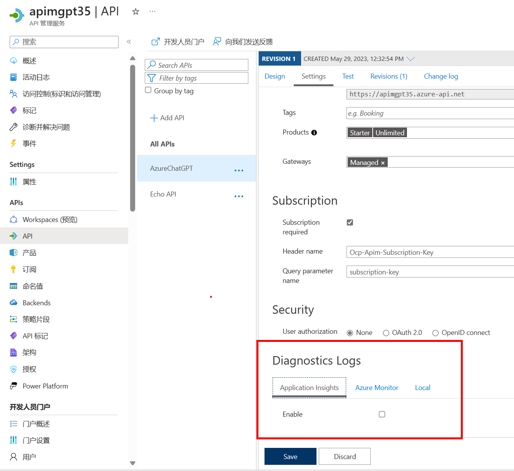

## 如果本地开发调试
- 按前面部署好Azure服务准备
- 复制 env.example到 .env, 并设定相关变量值
- 然后运行
```bash
npm install


#启动 express API server
npm run start:server

#另一窗口，启动前端
npm run dev
```
按提示访问前端即可

--- 


